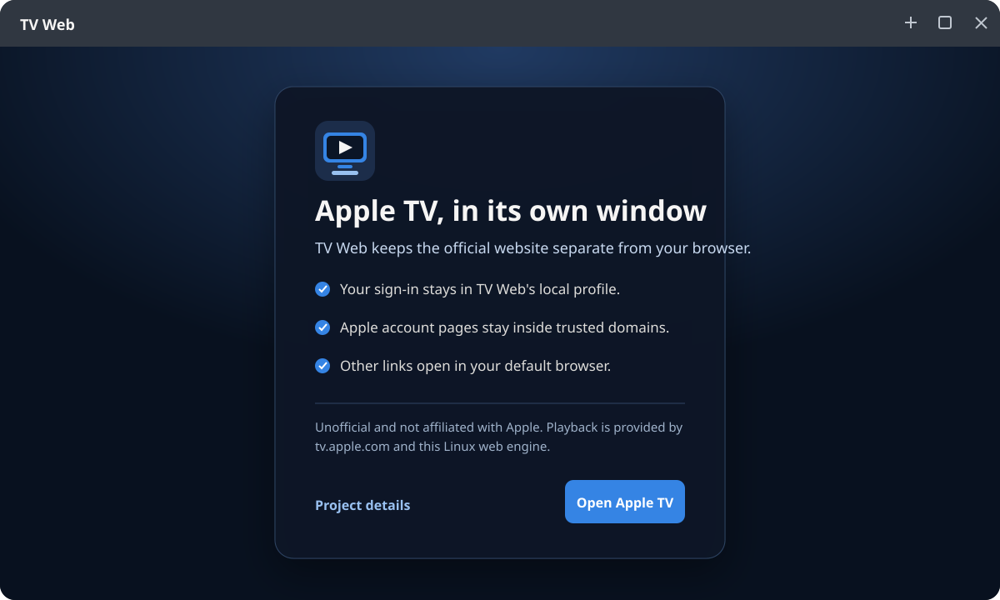

<h1 align="center">
  
  <br>
  TV Web
</h1>

<p align="center">
  A focused Fedora GNOME client for <a href="https://tv.apple.com">tv.apple.com</a>.
</p>

<p align="center">
  <a href="https://github.com/XaMiNeZH/apple-tv-linux/releases"></a>
  <a href="https://github.com/XaMiNeZH/apple-tv-linux/actions/workflows/test.yml"></a>
</p>

TV Web gives the official Apple TV website its own window, app icon, process,
and local profile. It does not replace Apple’s player or use unofficial
streaming APIs.



## Highlights

- **Desktop app:** Electron window, splash, first-run guide, fullscreen, and shortcuts
- **Separate session:** sign-in stays in TV Web’s `persist:tvweb` profile
- **Safe links:** Apple pages stay in-app; other web links open in your browser
- **GNOME-friendly:** proper icon, app menu, window titles, and remembered window size
- **Fedora package:** RPM, plus portable AppImage and tar.gz builds
- **Two architectures:** x86-64 and ARM64
- **Fallback:** GTK4/libadwaita setup for Chrome, Edge, or Firefox app mode

## Install on Fedora

Download your architecture from
[Releases](https://github.com/XaMiNeZH/apple-tv-linux/releases).
The RPM integrates with GNOME:

```bash
sudo dnf install ./tvweb-*-x86_64.rpm
```

For ARM64, use the `arm64`/`aarch64` asset. For a portable launch:

```bash
chmod +x tvweb-*-x86_64.AppImage
./tvweb-*-x86_64.AppImage
```

See the [Fedora guide](docs/fedora.md) for source installs, uninstalling, and
playback troubleshooting.

## Shortcuts

| Action | Shortcut |
| --- | --- |
| Back / Forward | <kbd>Alt</kbd>+<kbd>←</kbd> / <kbd>Alt</kbd>+<kbd>→</kbd> |
| Apple TV Home | <kbd>Ctrl</kbd>+<kbd>Shift</kbd>+<kbd>H</kbd> |
| Reload | <kbd>Ctrl</kbd>+<kbd>R</kbd> |
| Fullscreen | <kbd>F11</kbd> |
| Quit | <kbd>Ctrl</kbd>+<kbd>Q</kbd> |

## Honest limits

- Unofficial and not affiliated with Apple
- Playback, catalog, and region rules come from `tv.apple.com`
- No native Apple TV SDK, FairPlay workaround, or DRM circumvention
- No 4K, Dolby Vision, or Dolby Atmos claim
- Standard Electron may not have the DRM component a protected title needs
  ([use the browser fallback](docs/fedora.md#browser-fallback) if playback fails)

## Development

Requires Node.js 20+:

```bash
npm install
npm start
npm run test:electron
python3 -m pytest
```

Read the short [architecture guide](docs/architecture.md) before changing
navigation, profiles, or packaging.

## License

MIT. Apple, Apple TV, and related marks belong to Apple Inc.
